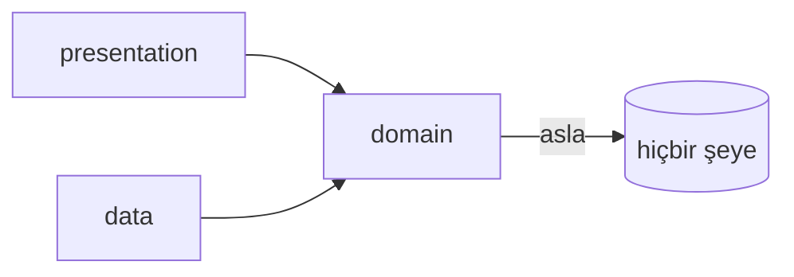
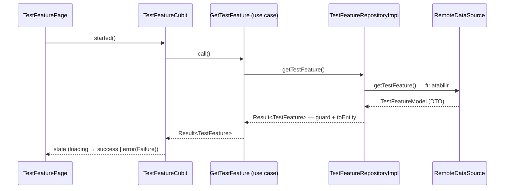

# Flutter Base

Üretime hazır bir Flutter şablonu — ve aynı zamanda bir **ders**.

Bu depo iki şey sunar:

1. **Çalışan bir başlangıç projesi:** Monorepo (melos), Feature-First Clean Architecture,
   DI, tek tip hata modeli, flavor'lar, lokalizasyon, design system, testler ve CI kurulu halde.
2. **Bu README:** Her kararın *neden* verildiğini, alternatiflerin neden elendiğini ve
   repodaki gerçek kodla *nasıl* uygulandığını anlatan bir rehber.

> **Sürümler:** Flutter **3.47.1** / Dart **3.13.1** (FVM ile sabitlenmiş, bkz. [Bölüm 4.1](#41-fvm--sdk-sürümünü-sabitlemek)).

---

## İçindekiler

- [1. Bu README Nasıl Okunmalı?](#1-bu-readme-nasıl-okunmalı)
- [2. Hızlı Başlangıç](#2-hızlı-başlangıç)
- [3. Büyük Resim: Neden Bir Base Projesi?](#3-büyük-resim-neden-bir-base-projesi)
- [4. Araç Zinciri](#4-araç-zinciri)
  - [4.1 FVM — SDK sürümünü sabitlemek](#41-fvm--sdk-sürümünü-sabitlemek)
  - [4.2 Melos — Monorepo yönetimi](#42-melos--monorepo-yönetimi)
  - [4.3 Kod üretim hattı: melos run gen](#43-kod-üretim-hattı-melos-run-gen)
- [5. Depo Haritası](#5-depo-haritası)
- [6. Mimari: Feature-First Clean Architecture](#6-mimari-feature-first-clean-architecture)
- [7. Çekirdek Ders 1: Hata Yönetimi — Result ve Failure](#7-çekirdek-ders-1-hata-yönetimi--result-ve-failure)
- [8. Çekirdek Ders 2: Dependency Injection](#8-çekirdek-ders-2-dependency-injection)
- [9. Network Katmanı](#9-network-katmanı)
- [10. Ortamlar: Flavor + envied](#10-ortamlar-flavor--envied)
- [11. Navigasyon: auto_route](#11-navigasyon-auto_route)
- [12. Lokalizasyon: slang](#12-lokalizasyon-slang)
- [13. State Management: Cubit + freezed](#13-state-management-cubit--freezed)
- [14. Model ve Entity: freezed dersleri](#14-model-ve-entity-freezed-dersleri)
- [15. Depolama](#15-depolama)
- [16. Monitoring ve Loglama](#16-monitoring-ve-loglama)
- [17. Design System ve Widgetbook](#17-design-system-ve-widgetbook)
- [18. Form Doğrulama: formz](#18-form-doğrulama-formz)
- [19. Test Stratejisi](#19-test-stratejisi)
- [20. Mason: Kod Üretimi](#20-mason-kod-üretimi)
- [21. CI: GitHub Actions](#21-ci-github-actions)
- [22. Reçeteler](#22-reçeteler)
- [23. Bilinen Sınırlar ve Yol Haritası](#23-bilinen-sınırlar-ve-yol-haritası)

---

## 1. Bu README Nasıl Okunmalı?

Her bölüm aynı kalıbı izler:

| Soru | Cevapladığı şey |
|------|-----------------|
| **Ne?** | Aracın/desenin tek cümlelik tanımı |
| **Neden?** | Hangi problemi çözüyor; alternatifler neden elendi |
| **Nasıl?** | Repodaki **gerçek** koddan örnek |
| **Nerede?** | Dosya yolları |

Projeyi ilk kez kuruyorsanız [Bölüm 2](#2-hızlı-başlangıç) yeterli.
"Neden böyle yapılmış?" sorusunun cevabı hangi bölümdeyse oradan okuyun; bölümler
küçükten büyüğe sıralıdır ama birbirinden bağımsız okunabilir.

---

## 2. Hızlı Başlangıç

```bash
# 1) Araçlar (bir kez)
dart pub global activate fvm
dart pub global activate melos
dart pub global activate mason_cli

# 2) SDK — .fvmrc içindeki sürümü kurar (3.47.1)
fvm install

# 3) Bağımlılıklar (monorepo'daki tüm paketler)
fvm exec melos bootstrap

# 4) Ortam değişkenleri (git'e girmez, şablondan kopyalanır)
cd apps/client
cp .env.example .env.dev && cp .env.example .env.staging && cp .env.example .env.prod
cd ../..

# 5) Kod üretimi (slang -> build_runner -> format)
fvm exec melos run gen

# 6) Çalıştır (her zaman --flavor ile!)
cd apps/client
fvm flutter run --flavor dev -t lib/main_dev.dart
```

> **Not:** Melos, `flutter`/`dart` komutlarını `PATH` üzerinden çalıştırır. Global FVM sürümünüz
> projeninkinden farklıysa melos komutlarını `fvm exec melos ...` biçiminde çalıştırın.

Doğrulama:

```bash
fvm exec melos run analyze   # 0 issue beklenir
fvm exec melos run test      # tüm paketlerde testler
```

---

## 3. Büyük Resim: Neden Bir Base Projesi?

**Problem:** Her yeni projede aynı kararlar yeniden verilir (state management, DI, hata
yönetimi, flavor'lar, lokalizasyon...), aynı altyapı yeniden yazılır ve her seferinde
biraz farklı yazıldığı için ekipler arasında bilgi taşınamaz.

**Çözüm:** Kararları **bir kez**, gerekçeleriyle birlikte ver; altyapıyı paketlere ayır;
yeni projeyi ve yeni feature'ı **şablondan üret** ([Bölüm 20](#20-mason-kod-üretimi)).

Bu reponun üç kullanım şekli vardır:

1. **Şablon olarak:** `mason make project_starter_brick --name yeni_proje` → dakikalar içinde,
   isimlendirilmiş ve derlenen yeni bir proje.
2. **Referans olarak:** "Biz X'i nasıl yapıyorduk?" sorusunun cevabı buradaki kod ve bu README.
3. **Oyun alanı olarak:** Yeni bir yaklaşım önce burada denenir, testleriyle kanıtlanır, sonra
   gerçek projelere taşınır.

---

## 4. Araç Zinciri

### 4.1 FVM — SDK sürümünü sabitlemek

**Ne?** [FVM](https://fvm.app), Flutter SDK sürümlerini proje bazında sabitler.

**Neden?** "Bende çalışıyor" problemlerinin en büyük kaynağı ekip üyelerinin farklı Flutter
sürümleri kullanmasıdır. Sürüm tek bir dosyada ([`.fvmrc`](.fvmrc)) yaşar; kim klonlarsa
`fvm install` ile **aynı** SDK'yı alır. CI da aynı sürüme pinlidir ([Bölüm 21](#21-ci-github-actions)).

```jsonc
// .fvmrc
{
  "flutter": "3.47.1"
}
```

Bununla tutarlı olarak tüm `pubspec.yaml` dosyalarında alt sınır aynı Dart sürümüdür:

```yaml
environment:
  sdk: ^3.13.1
```

**Günlük kullanım:**

```bash
fvm flutter run ...     # tekil komut
fvm dart run ...
fvm exec melos ...      # melos'un alt süreçleri de doğru SDK'yı görsün diye
```

> **Kararın hikâyesi:** melos'un `sdkPath` ayarı vardır ama melos 6, yolu shell'e quote'lamadan
> geçirdiği için boşluk içeren dizinlerde (bu repo: `Flutter Base/`) kırılır. Bu yüzden SDK
> seçimini `fvm exec`/`PATH` üzerinden yapıyoruz.

### 4.2 Melos — Monorepo yönetimi

**Ne?** [melos](https://melos.invertase.dev), birden çok Dart/Flutter paketini tek repoda yönetir.

**Neden monorepo?** `core` (altyapı) ve `design_system` (UI kiti), uygulamadan bağımsız
test edilip yeniden kullanılabilsin; ama tek repo içinde atomik değişiklik yapılabilsin
(bir PR'da hem core'u hem onu kullanan uygulamayı değiştirmek). Paket sınırı, mimari sınırı
**derleyiciye** zorlatır: `core`, uygulamaya bağımlı **olamaz**.

[`melos.yaml`](melos.yaml) içindeki paketler ve script'ler (özet):

```yaml
packages:
  - apps/*        # client, widgetbook
  - packages/*    # core, design_system

scripts:
  analyze:       # tüm paketlerde dart analyze
  format:        # tüm paketleri formatlar
  format:check:  # CI için: formatlanmamış dosya varsa hata döner
  test:          # test/ klasörü olan tüm paketlerde flutter test
  gen:           # bkz. 4.3
  clean:         # tüm paketlerde flutter clean
```

> **Neden hâlâ melos 6?** Melos 7+, `melos.yaml`'ı kaldırıp Dart'ın *pub workspaces*
> özelliğini zorunlu kılıyor. Bu, brick/hook/CI zincirini de değiştiren ayrı bir migrasyon;
> bilinçli olarak ertelendi ([Bölüm 23](#23-bilinen-sınırlar-ve-yol-haritası)).

### 4.3 Kod üretim hattı: melos run gen

**Ne?** Tüm üretilen kodu (çeviriler, freezed, DI, router, env) tek komutla üretir:

```
melos run gen  =  gen:slang  →  gen:build_runner  →  format
                  (dart run slang)  (dart run build_runner build)
```

**Neden bu sıra?**

- **Önce slang, üstelik CLI ile:** slang'ın build_runner entegrasyonu çevirileri bir
  *post-process builder* ile yazar; bu çıktılar **aynı build içindeki diğer builder'lara
  görünmez**. Sonuç: injectable, `Translations` tipini çözemez ve üretim patlar. slang CLI
  (`dart run slang`) dosyaları normal kaynak olarak yazdığı için build_runner onları görür.
  Bu yüzden `slang_build_runner` bağımlılığı kaldırıldı; konfigürasyon
  [`apps/client/slang.yaml`](apps/client/slang.yaml) dosyasındadır.
- **Sonda format:** injectable'ın ürettiği kod, projenin kullandığı formatter stilinden
  farklı çıkabiliyor. `gen` sonunda `melos run format` çalıştığı için üretilen kod her zaman
  proje stilindedir ve CI'daki `format:check` geçer.

Üretilen dosya türleri: `*.freezed.dart`, `*.g.dart`, `*.gr.dart` (router), `*.config.dart`
ve `*.module.dart` (DI), `strings*.g.dart` (çeviri), `assets.gen.dart` (asset'ler).

---

## 5. Depo Haritası

```
flutter_base/
├── .fvmrc                     # Sabitlenmiş Flutter sürümü (3.47.1)
├── melos.yaml                 # Monorepo script'leri
├── analysis_options.yaml      # Ortak lint kuralları (paketler kendi kopyasını içerir)
├── apps/
│   ├── client/                # Asıl uygulama
│   │   ├── lib/
│   │   │   ├── main_dev.dart / main_staging.dart / main_prod.dart   # Flavor girişleri
│   │   │   ├── bootstrap.dart          # Uygulama açılış hattı
│   │   │   ├── app.dart                # MaterialApp.router + tema + locale
│   │   │   ├── config/                 # AppFlavor, firebase_options
│   │   │   ├── env/                    # envied sınıfları (EnvDev, ...)
│   │   │   ├── core/
│   │   │   │   ├── dependency/         # get_it + injectable (di.dart)
│   │   │   │   ├── router/             # auto_route (app_router.dart)
│   │   │   │   ├── translations/       # slang json + üretilen strings.g.dart
│   │   │   │   ├── error/              # failure_localizer.dart
│   │   │   │   └── storage/            # SecureTokenStorage
│   │   │   └── features/               # Feature-First: home, test_feature, ...
│   │   ├── test/                       # Unit + widget testleri
│   │   ├── integration_test/           # Cihazda boot testi
│   │   ├── slang.yaml                  # Çeviri üretim konfigürasyonu
│   │   └── .env.example                # Ortam değişkeni şablonu
│   └── widgetbook/            # Design system vitrini (ayrı uygulama)
├── packages/
│   ├── core/                  # Uygulamadan bağımsız altyapı (aşağıda)
│   └── design_system/         # Tema, token'lar, ortak widget'lar
├── mason/bricks/
│   ├── feature_brick/         # Yeni feature şablonu
│   └── project_starter_brick/ # Yeni proje şablonu (bu reponun kopyası)
└── tool/
    ├── create_brick.dart      # Kaynak -> project_starter_brick senkronu
    └── sort_pubspecs.dart     # pubspec bağımlılıklarını alfabetik sıralar
```

**`packages/core` ne içerir?** Herhangi bir projede aynen kullanılabilecek şeyler:
network (`ApiClient`, interceptor'lar), hata modeli (`Result`, `Failure`), depolama
soyutlamaları, izleme (`MonitoringService`), form input'ları, logger. **İçermediği** şeyler:
UI, route, çeviri, marka — onlar uygulamanın ve design system'in işi.

---

## 6. Mimari: Feature-First Clean Architecture

**Ne?** Kod, teknik katmanlara göre değil **özelliklere** göre örgütlenir; her özelliğin
içinde üç katman vardır.

```
lib/features/test_feature/
├── data/           # Dış dünya: API modeli, datasource, repository implementasyonu
├── domain/         # Saf Dart iş mantığı: entity, repository sözleşmesi, use case
└── presentation/   # UI: Cubit/State, Page, çeviriler
```

**Neden feature-first (katman-first değil)?**

- Bir özellik üzerinde çalışırken dosyalar yan yanadır; "5 klasörde gezinme" olmaz.
- Bir özellik silinirken/taşınırken tek klasör taşınır.
- Ekipler feature bazında paralel çalışabilir; merge çatışması azalır.

**Bağımlılık kuralı** (ok yönü "bağımlıdır" demektir):



`domain` katmanı Flutter'ı bile bilmez; bu sayede iş kuralları saf Dart testleriyle test edilir.
`data`, `domain`'deki sözleşmeyi (abstract repository) uygular; `presentation` yalnızca
`domain`'i çağırır.

**Bir isteğin yaşam döngüsü:**



**"Use case gereksiz değil mi?"** Tek satırlık delegasyon gibi görünür, ama iki şey kazandırır:
(1) Presentation, repository'nin *tamamına* değil tek bir işleme bağlanır; (2) iş kuralı
büyüdüğünde (cache stratejisi, birden çok repository'yi birleştirme) değişecek yer bellidir.
Şablonda bilinçli olarak korunmuştur.

---
## 7. Çekirdek Ders 1: Hata Yönetimi — Result ve Failure

**Ne?** Tüm hatalar tek bir tipte akar: `Failure`. Başarısız olabilen her işlem
`Result<T>` döner. `dartz`/`Either` **kullanılmaz**.

**Neden?**

- `dartz` 2021'den beri güncellenmiyor ve Dart 3'ün *sealed class* + *pattern matching*
  özellikleri `Either`'ın yaptığı her şeyi dile yerleşik olarak yapıyor.
- İki paralel hata modeli (bir `Either<Failure, T>`, bir `DataResult/NetworkFailure`)
  vardı; "hangi katmanda hangisi?" karmaşası tek modelle bitti.
- Exception → Failure dönüşümü **tek bir dosyada** yaşar; yeni bir hata türü eklemek
  tek yeri değiştirmek demektir.

### Akış

1. **Data source'lar sadece fırlatır.** Dio zaten `DioException` fırlatır; kendi
   hatalarınız için `AppException` alt sınıflarını kullanın (`ServerException`,
   `CacheException`, `JsonFormatException`, `AuthTokenException`).
2. **Repository, çağrıyı `Result.guard` ile sarar.** Fırlatılan her şey
   `failureFromException` ile `Failure`'a çevrilir.
3. **Cubit `switch` ile dallanır**, state `Failure`'ın **kendisini** taşır (String değil!).
4. **UI**, metni `failure.localizedMessage` ile gösterir; özel durumlara tipiyle tepki verir.

Gerçek kod — repository ([test_feature_repository_impl.dart](apps/client/lib/features/test_feature/data/repositories/test_feature_repository_impl.dart)):

```dart
@override
Future<Result<TestFeature>> getTestFeature() async {
  // Result.guard: data source'un fırlattığı her şeyi (Dio hataları,
  // AppException'lar, parse hataları) Failure'a çevirir.
  final result = await Result.guard(_remoteDataSource.getTestFeature);
  return result.map((model) => model.toEntity());
}
```

Cubit ([test_feature_cubit.dart](apps/client/lib/features/test_feature/presentation/bloc/test_feature_cubit.dart)):

```dart
Future<void> started() async {
  emit(const TestFeatureState.loading());
  final result = await _getTestFeature();
  switch (result) {
    case Success(:final data):
      emit(TestFeatureState.success(data));
    case FailureResult(:final failure):
      emit(TestFeatureState.error(failure));
  }
}
```

UI ([test_feature_page.dart](apps/client/lib/features/test_feature/presentation/pages/test_feature_page.dart)):

```dart
error: (failure) => Center(child: Text(failure.localizedMessage)),
```

### Failure — neden public union sınıfları?

[`failure.dart`](packages/core/lib/src/exceptions/failure.dart) freezed union'ıdır ama case
sınıfları bilinçli olarak **public**'tir (`ServerFailure`, `UnauthorizedFailure`, ...):

```dart
@freezed
sealed class Failure with _$Failure {
  const factory Failure.server(String message, [int? code]) = ServerFailure;
  const factory Failure.network(String message) = NetworkFailure;
  const factory Failure.unauthorized(String message) = UnauthorizedFailure;
  const factory Failure.forbidden(String message) = ForbiddenFailure;
  const factory Failure.notFound(String message) = NotFoundFailure;
  const factory Failure.validation(String message, [Map<String, dynamic>? errors]) = ValidationFailure;
  const factory Failure.cache(String message, [int? code]) = CacheFailure;
  const factory Failure.canceled([@Default('Request was canceled') String message]) = CanceledFailure;
  const factory Failure.unknown(String message, [Object? error]) = UnknownFailure;
}
```

Freezed varsayılanı (`_ServerFailure` gibi) private'tır ve **başka kütüphaneden pattern match
edilemez**. Public isimler sayesinde her yerde exhaustive `switch` yazılabilir:

```dart
switch (failure) {
  case UnauthorizedFailure():
    context.router.replaceAll([const LoginRoute()]); // oturum düştü -> login
  case ValidationFailure(:final errors):
    showInputErrors(errors);                          // alan bazlı hatalar
  case Failure(:final message):
    showSnackBar(message);                            // geri kalan her şey
}
```

### Tek dönüşüm noktası: failureFromException

[`failure_mapper.dart`](packages/core/lib/src/exceptions/failure_mapper.dart) transport
detaylarını bilen **tek** dosyadır: Dio timeout'ları → `NetworkFailure`, 401 → `Unauthorized`,
403 → `Forbidden`, 404 → `NotFound`, 400/422 → `ValidationFailure` (payload'daki `message`
ve `errors` alanlarını okur), 5xx → `ServerFailure(message, code)`, iptal → `CanceledFailure`,
sınıflandırılamayan → `UnknownFailure` (orijinal hata objesiyle; `Result.guard` bunu loglar).
API'nizin hata gövdesi farklıysa **yalnızca** bu dosyadaki `_messageFromPayload` /
`_errorsFromPayload` fonksiyonlarını uyarlarsınız.

### Result — küçük ama yeterli

[`result.dart`](packages/core/lib/src/result/result.dart) el yazımı, ~120 satırlık sealed
sınıftır (kütüphane değil — okunabilir olsun diye):

```dart
sealed class Result<T> {
  const factory Result.success(T data) = Success<T>;
  const factory Result.failure(Failure failure) = FailureResult<T>;
  static Future<Result<T>> guard<T>(Future<T> Function() call) async { ... }

  R fold<R>({required R Function(Failure) onFailure, required R Function(T) onSuccess});
  Result<R> map<R>(R Function(T data) transform);      // model -> entity için
  Result<R> flatMap<R>(Result<R> Function(T) transform); // zincirleme adımlar için
  T? get dataOrNull;  Failure? get failureOrNull;
  bool get isSuccess; bool get isFailure;
}
```

### Kullanıcıya gösterilecek metin: localizedMessage

Teknik mesajlar (stack trace, "socket closed") kullanıcıya gösterilmez.
[`failure_localizer.dart`](apps/client/lib/core/error/failure_localizer.dart) uygulama
tarafındadır (çeviriye erişmesi gerekir) ve slang'ın `errors` namespace'ini kullanır:

```dart
extension FailureLocalization on Failure {
  String get localizedMessage => switch (this) {
    NetworkFailure() => t.errors.network,   // "İnternet bağlantınızı kontrol edip..."
    ServerFailure() => t.errors.server,
    ValidationFailure(:final message) =>
      message.trim().isNotEmpty ? message : t.errors.validation, // backend mesajı aynen
    ...
  };
}
```

Kural: **validation mesajları** backend'den geldiği gibi gösterilir (son kullanıcı için
yazılmıştır: "Bu e-posta zaten kayıtlı"); diğer her şey jenerik yerelleştirilmiş metne düşer.
Orijinal `failure.message` loglama için her zaman durur.

**Nerede?** Model: `packages/core/lib/src/exceptions/`, `packages/core/lib/src/result/`.
Testleri: `packages/core/test/src/` (mapper'ın tüm dalları) ve
`apps/client/test/core/error/` (lokalizasyon, TR dahil).

---

## 8. Çekirdek Ders 2: Dependency Injection

**Ne?** [get_it](https://pub.dev/packages/get_it) (service locator) +
[injectable](https://pub.dev/packages/injectable) (anotasyonlardan kayıt kodu üretimi).

**Neden?** Sınıflar bağımlılıklarını kendileri **kurmasın** (test edilemez hale gelir),
constructor'dan alsın; kayıt kodunu da elle yazmayalım (unutulur, sıra bozulur).

### Günlük kullanım

```dart
@lazySingleton                       // ilk istendiğinde bir kez kurulur
class GetTestFeature { ... }

@injectable                          // her istendiğinde yeni instance (ör. Cubit)
class TestFeatureCubit extends Cubit<TestFeatureState> { ... }

@LazySingleton(as: TestFeatureRepository)   // arayüze karşı kayıt -> testte mock'lanır
class TestFeatureRepositoryImpl implements TestFeatureRepository { ... }
```

Kayıt kodu `melos run gen` ile [`di.config.dart`](apps/client/lib/core/dependency/di.config.dart)
içine üretilir; elle dokunulmaz. Kullanım: `getIt<TestFeatureCubit>()`.

### Ders: core neden bir "micro package"?

build_runner **yalnızca kendi paketini** tarar. `core` içindeki `@injectable` sınıfları
(ApiClient, MonitoringService, ...) uygulamanın `di.config.dart`'ına kendiliğinden giremez —
bu, şablonun ilk halinde gerçek bir hataydı: `getIt<MonitoringService>()` açılışta patlıyordu.

Çözüm, injectable'ın *micro package* mekanizması:

```dart
// packages/core/lib/flutter_base_core.dart
@InjectableInit.microPackage(ignoreUnregisteredTypes: [TokenStorage])
void initMicroPackage() {}   // çağrılmaz; yalnızca üretime işaret eder
```

Bu, `flutter_base_core.module.dart` içinde `FlutterBaseCorePackageModule` sınıfını üretir;
uygulama onu tek satırla içeri alır:

```dart
// apps/client/lib/core/dependency/di.dart
@InjectableInit(
  externalPackageModulesBefore: [ExternalModule(FlutterBaseCorePackageModule)],
)
Future<void> configureDependencies({required String environment}) async {
  await getIt.init(environment: environment);
}
```

**Sözleşme:** core, uygulamanın bilmesi gerekenleri *ister*: `TokenStorage` implementasyonu
(uygulamada `SecureTokenStorage`) ve `@Named('baseUrl')` String'i (AppModule flavor'dan üretir).
`ignoreUnregisteredTypes: [TokenStorage]` bu bilinçli boşluğu belgeler.

### Ortama göre kayıt: @Environment

```dart
// apps/client/lib/config/app_flavor.dart
@Singleton(as: AppFlavor)
@Environment(Env.dev)
class DevFlavor implements AppFlavor { ... }   // yalnızca dev ortamında kayıt olur
```

`configureDependencies(environment: Env.dev)` çağrısı hangi flavor sınıfının kayıt olacağını
seçer; kod içinde hiçbir yerde `if (flavor == ...)` yazılmaz.

### Asenkron kurulum: @preResolve

Bazı bağımlılıklar kullanılmadan önce `await` ister. `@preResolve`, onları `getIt.init`
sırasında hazır eder:

```dart
// packages/core/lib/src/di/core_module.dart
@preResolve
@singleton
Future<KeyValueStorage> keyValueStorage() async {
  final storage = KeyValueStorageImpl();
  await storage.init();          // SharedPreferences.getInstance()
  return storage;
}
```

Aynı desen çeviriler için de kullanılır (AppModule → `Translations`).

### Ders: Firebase yapılandırılmadan da açılmak

`CoreModule.monitoringService()` Firebase kurulmuş mu diye bakar:

```dart
@lazySingleton
MonitoringService monitoringService() => Firebase.apps.isEmpty
    ? const LoggerMonitoringService()      // konsola loglar; uygulama yine açılır
    : FirebaseMonitoringService(FirebaseAnalytics.instance, FirebaseCrashlytics.instance);
```

Neden? `flutterfire configure` çalıştırılmamış bir şablon projesi **yine de boot edebilmeli**.
[bootstrap.dart](apps/client/lib/bootstrap.dart) de Firebase init'i try/catch ile korur.
Ayrıntı: [Bölüm 16](#16-monitoring-ve-loglama).

**Nerede?** `apps/client/lib/core/dependency/`, `packages/core/lib/src/di/`.
DI'ın bütününü kilitleyen smoke test: `apps/client/test/core/dependency/di_test.dart`.

---

## 9. Network Katmanı

**Ne?** [dio](https://pub.dev/packages/dio) + interceptor zinciri + ince bir `ApiClient` sarmalayıcısı.

**Neden dio (http değil)?** Interceptor'lar (token ekleme, retry, log), istek iptali
(`CancelToken`), timeout yönetimi ve zengin hata tipi (`DioException`) — hepsi hazır.

Kurulum tek yerde, DI modülünde ([network_module.dart](packages/core/lib/src/di/network_module.dart)):

```dart
@lazySingleton
Dio dio(@Named('baseUrl') String baseUrl, AuthInterceptor authInterceptor) {
  final dio = Dio(BaseOptions(
    baseUrl: baseUrl,                              // flavor'dan gelir (Bölüm 10)
    connectTimeout: const Duration(seconds: 30),
    receiveTimeout: const Duration(seconds: 30),
  ));

  dio.interceptors.addAll([
    authInterceptor,                               // 1) Authorization header
    RetryInterceptor(dio: dio, retries: 3, ...),   // 2) geçici hatalarda tekrar dene
    if (kDebugMode) PrettyDioLogger(...),          // 3) yalnızca debug'da log
  ]);
  return dio;
}
```

**Interceptor sırası bilinçlidir:** önce auth (retry edilen istek de token taşısın),
log en sonda (nihai isteği görsün).

`AuthInterceptor` token'ı nereden alacağını **bilmez**; core'daki `TokenStorage` arayüzünü
kullanır, implementasyonu uygulama verir ([Bölüm 15](#15-depolama)):

```dart
@override
Future<void> onRequest(RequestOptions options, RequestInterceptorHandler handler) async {
  final token = await _tokenStorage.getAccessToken();
  if (token != null && token.isNotEmpty) {
    options.headers['Authorization'] = 'Bearer $token';
  }
  super.onRequest(options, handler);
}
```

`ApiClient`, dio'nun get/post/put/delete/patch metodlarını tipli şekilde sarar; data source'lar
dio'ya değil ona bağımlıdır (dio'yu değiştirmek gerekirse tek dosya değişir).

> **Yol haritası:** 401'de refresh-token akışı (`QueuedInterceptor` ile) `AuthInterceptor.onError`
> içinde işaretlenmiş bilinçli bir TODO'dur; auth feature'ı ile birlikte gelecek.

**Nerede?** `packages/core/lib/src/network/`.

---

## 10. Ortamlar: Flavor + envied

**Ne?** Üç ortam: `dev`, `staging`, `prod`. Bir ortam = üç parçanın toplamı:

| Parça | Nerede | Ne belirler |
|-------|--------|-------------|
| Dart giriş noktası | `lib/main_dev.dart` ... | DI environment'ı (`Env.dev`) |
| Derleme zamanı değişkenleri | `.env.dev` + `lib/env/env_dev.dart` | BASE_URL, API anahtarları |
| Platform yapılandırması | Android `productFlavors` / iOS scheme'leri | Paket adı, uygulama adı, ikon |

### Dart tarafı: AppFlavor

```dart
// main_dev.dart
void main() {
  bootstrap(builder: () => const App(), environment: Env.dev);
}
```

`Env.dev` → DI yalnızca `DevFlavor`'ı kaydeder ([Bölüm 8](#8-çekirdek-ders-2-dependency-injection));
uygulama içinde ortam bilgisi `getIt<AppFlavor>()` üzerinden okunur (`title`, `baseUrl`, `enableLogs`).

### Değişkenler: envied

**Neden envied (--dart-define değil)?** Tip güvenli sınıf üretir, `.env` dosyalarıyla çalışır
(CI/CD'de yönetmesi kolay) ve değerleri **obfuscate** edebilir.

```dart
// apps/client/lib/env/env_dev.dart
@Envied(path: '.env.dev', obfuscate: true)
abstract class EnvDev {
  @EnviedField(varName: 'KEY')
  static final String key = _EnvDev.key;

  @EnviedField(varName: 'BASE_URL', defaultValue: 'https://dev.api.example.com')
  static final String baseUrl = _EnvDev.baseUrl;
}
```

**Güvenlik kararları (ders):**

- `.env.*` dosyaları **git'e girmez**; şablon olarak [`.env.example`](apps/client/.env.example) vardır.
- Üretilen `lib/env/*.g.dart` dosyaları da **git'e girmez** (`.gitignore`) — obfuscate edilmiş
  olsalar bile üretilen dosyada değerler geri çıkarılabilir. `melos run gen` yeniden üretir.
- CI, gerçek sır olmadan çalışabilsin diye `.env.example`'ı kopyalar ([Bölüm 21](#21-ci-github-actions)).
- **Dürüst not:** obfuscation şifreleme değildir; istemciye gömülen hiçbir değer gerçekten
  gizli kalmaz. Gerçek sırlar backend'de tutulmalıdır.

### Android: productFlavors

[`apps/client/android/app/build.gradle`](apps/client/android/app/build.gradle):

```groovy
flavorDimensions += ["environment"]
productFlavors {
    dev {
        dimension = "environment"
        applicationIdSuffix = ".dev"        // com.example.flutter_base.dev
        versionNameSuffix = "-dev"
        resValue "string", "app_name", "Flutter Base Dev"
    }
    staging { ... }
    prod {
        dimension = "environment"
        resValue "string", "app_name", "Flutter Base"
    }
}
```

- `applicationIdSuffix` sayesinde dev/staging/prod **aynı cihaza yan yana** kurulur.
- `app_name` flavor başına `resValue` ile verilir (AGP 8+ için `buildFeatures { resValues = true }` gerekir).
- Flavor ikonu: `android/app/src/<flavor>/res/mipmap-*/`.

iOS tarafında karşılıklar hazırdır: `dev`/`staging`/`prod` scheme'leri + xcconfig'ler.

### Çalıştırma

```bash
cd apps/client
fvm flutter run  --flavor dev     -t lib/main_dev.dart
fvm flutter build apk --flavor prod -t lib/main_prod.dart
```

> Flavor tanımlı olduğu için `--flavor` **her zaman zorunludur**. VS Code kullanıyorsanız
> [.vscode/launch.json](.vscode/launch.json) içinde üç ortam da hazır.

---

## 11. Navigasyon: auto_route

**Ne?** Kod üretimiyle tip güvenli routing.

**Neden auto_route (go_router değil)?** Route'lar üretilen sınıflardır: parametre eklemek
derleme hatasıyla kendini belli eder, string path elle yazılmaz. Guard mekanizması (auth
akışı için) ve iç içe navigasyon desteği güçlüdür. go_router da geçerli bir seçimdir;
şablon, tip güvenliğini önceliklediği için auto_route'u kullanır.

```dart
// apps/client/lib/core/router/app_router.dart
@singleton                       // DI'a da kayıtlıdır -> getIt<AppRouter>()
@AutoRouterConfig()
class AppRouter extends RootStackRouter {
  @override
  List<AutoRoute> get routes => [
    AutoRoute(page: HomeRoute.page, initial: true),
  ];
}
```

Bir sayfayı route yapmak: widget'a `@RoutePage()` ekle, `melos run gen` çalıştır,
`routes` listesine `AutoRoute(page: XRoute.page)` ekle ve **sayfanın import'unu router
dosyasına yaz** (üretilen `.gr.dart` bir *part* dosyasıdır; import'ları router dosyasından alır).

> **Kolaylık:** `feature_brick` ile üretilen sayfalarda bu kaydı hook otomatik yapar
> ([Bölüm 20](#20-mason-kod-üretimi)).

Kullanım:

```dart
context.router.push(TestFeatureRoute());
// veya
getIt<AppRouter>().replaceAll([const LoginRoute()]);
```

---

## 12. Lokalizasyon: slang

**Ne?** JSON dosyalarından tip güvenli çeviri sınıfları üreten kütüphane.

**Neden slang (intl/arb veya easy_localization değil)?**

- `t.home.hello(name: 'X')` — anahtar adı yanlışsa **derleme hatası** (string anahtar yok).
- **Namespace** desteği: her feature kendi çeviri dosyasını yanında taşır.
- Parametreler, çoğullar ve locale yönetimi tek pakette.

Konfigürasyon [`apps/client/slang.yaml`](apps/client/slang.yaml):

```yaml
base_locale: en
input_directory: lib
input_file_pattern: .i18n.json
output_directory: lib/core/translations
namespaces: true
translate_var: t
enum_name: AppLocale
```

Dosya adı deseni **`<namespace>_<locale>.i18n.json`** — çok kelimeli namespace'lerde
**camelCase** kullanılır (slang kuralı):

```
lib/core/translations/common_en.i18n.json      -> t.common...
lib/core/translations/errors_en.i18n.json      -> t.errors...   (Bölüm 7'nin metinleri)
lib/features/home/presentation/translations/home_en.i18n.json -> t.home...
lib/features/x/presentation/translations/orderHistory_en.i18n.json -> t.orderHistory...
```

```jsonc
// home_en.i18n.json
{ "hello": "Hello $name" }
```

```dart
Text(t.home.hello(name: flavor.title))          // tip güvenli parametre
await LocaleSettings.setLocale(AppLocale.tr);   // dil değiştirme (Future döner - slang 4)
```

Açılışta cihaz dili kullanılır (AppModule, `Translations`'ı `@preResolve` ile hazırlar);
`app.dart` bunu `TranslationProvider` + `MaterialApp` locale ayarlarıyla UI'a bağlar.

**Yeni dil eklemek:** her namespace için `<namespace>_<locale>.i18n.json` dosyalarını ekleyin,
`melos run gen` çalıştırın — `AppLocale` enum'ı kendiliğinden genişler.

---

## 13. State Management: Cubit + freezed

**Ne?** [flutter_bloc](https://pub.dev/packages/flutter_bloc)'un `Cubit`'i + freezed sealed state'ler.

**Neden Cubit (tam Bloc değil)?** Şablondaki akışlar istek/cevap türündedir; event sınıfları
katmanı burada değer katmaz. Event-driven bir akış gerektiğinde (ör. arama debounce)
aynı pakettesiniz — `Bloc`'a geçmek doğaldır.

State, freezed union'ıdır ve **`sealed`**'dır; hata durumu `Failure` taşır:

```dart
@freezed
sealed class TestFeatureState with _$TestFeatureState {
  const factory TestFeatureState.initial() = _Initial;
  const factory TestFeatureState.loading() = _Loading;
  const factory TestFeatureState.success(TestFeature data) = _Success;
  const factory TestFeatureState.error(Failure failure) = _Error;
}
```

UI tarafında `state.when(...)` kullanılabilir (freezed üretir) veya Dart 3 `switch` —
ikisi de tüm durumları kapsamaya zorlar; "loading'i unutmuşuz" olmaz.

Tüm bloc'ların yaşam döngüsü [`AppBlocObserver`](packages/core/lib/src/monitoring/app_bloc_observer.dart)
tarafından izlenir: debug'da loglar, release'te `onError` çağrılarını Crashlytics'e iletir
(`bootstrap.dart` içinde `Bloc.observer` olarak atanır).

---

## 14. Model ve Entity: freezed dersleri

**Ne?** [freezed](https://pub.dev/packages/freezed): immutable sınıflar, `==`/`copyWith`/
`toString` üretimi, union'lar. JSON için `json_serializable` ile birlikte çalışır.

**Model (DTO) ve Entity neden ayrı?** `TestFeatureModel` API'nin şeklidir (JSON alanları,
yeniden adlandırmalar); `TestFeature` iş mantığının şeklidir. API değişince domain
katmanı etkilenmez — değişiklik `toEntity()` mapper'ında emilir.

```dart
// data/models/test_feature_model.dart
@freezed
abstract class TestFeatureModel with _$TestFeatureModel {
  const factory TestFeatureModel({required String id}) = _TestFeatureModel;
  const TestFeatureModel._();

  factory TestFeatureModel.fromJson(Map<String, dynamic> json) =>
      _$TestFeatureModelFromJson(json);

  /// Maps this DTO to its domain entity.
  TestFeature toEntity() => TestFeature(id: id);
}
```

**Ders — neden `extends TestFeature` değil?** Freezed 2 döneminde model, entity'yi extend
ederdi. Freezed 3+ üretilen sınıflarda gerçek kalıtım kullanır ve super constructor'ı
(`super._()`) çağırması gerekir; `_` **kütüphane-private** olduğu için başka dosyadaki
entity'ye ulaşamaz. Ayrıca üretilen `copyWith` tipleri çakışır (gerçek derleme hatası).
Doğru desen: **kalıtım değil, mapping** (`toEntity()`).

**Freezed 3+ hatırlatmaları:**

- Union'lar `sealed class`, tek constructor'lı data sınıfları `abstract class` olmalı.
- Metod/getter ekleyecekseniz `const MyClass._();` constructor'ı gerekir.
- `when/map` hâlâ üretilir; ama yeni kodda Dart 3 `switch` tercih edin (dilin kendisi
  exhaustiveness'ı denetler).

---

## 15. Depolama

İki ayrı ihtiyaç, iki ayrı araç:

| İhtiyaç | Araç | Neden |
|---------|------|-------|
| Basit tercihler: tema, dil, onboarding bayrağı | `KeyValueStorage` (SharedPreferences) | Hızlı, şifreleme gereksiz |
| Hassas veri: access/refresh token | `SecureTokenStorage` (flutter_secure_storage) | Keychain/Keystore'da şifreli durur |

`KeyValueStorage` bir **arayüzdür** ([key_value_storage.dart](packages/core/lib/src/storage/key_value_storage.dart));
implementasyonu (`KeyValueStorageImpl`) DI'da `@preResolve` ile hazırlanır — kullanan kod
`init()` çağrıldı mı diye düşünmez:

```dart
final storage = getIt<KeyValueStorage>();
await storage.setString('theme_mode', 'dark');
final theme = storage.getString('theme_mode');
```

Token depolama sözleşmesi core'da (`TokenStorage`), implementasyonu uygulamadadır
([secure_token_storage.dart](apps/client/lib/core/storage/secure_token_storage.dart),
`@LazySingleton(as: TokenStorage)`); `AuthInterceptor` yalnızca sözleşmeyi bilir.
Bu ayrım sayesinde core, "token nerede durur" kararına bağımlı değildir.

---

## 16. Monitoring ve Loglama

**Ne?** `MonitoringService` arayüzü + iki implementasyon:

- `FirebaseMonitoringService` — Analytics + Crashlytics.
- `LoggerMonitoringService` — konsola loglar; **Firebase yapılandırılmadıysa** devreye girer.

**Neden arayüz?** (1) Vendor değiştirilebilir (Sentry'ye geçiş = tek sınıf);
(2) testlerde mock'lanır; (3) şablon Firebase kurulmadan da çalışır.

Açılış hattı ([bootstrap.dart](apps/client/lib/bootstrap.dart)) tüm hata yakalama
noktalarını bağlar:

```dart
await runZonedGuarded(() async {
  WidgetsFlutterBinding.ensureInitialized();
  await _initializeFirebase();                    // yapılandırılmadıysa loglayıp geçer
  await configureDependencies(environment: environment);
  final monitoringService = getIt<MonitoringService>();
  await monitoringService.initialize();
  Bloc.observer = AppBlocObserver(monitoringService);
  FlutterError.onError = (details) { ... };       // framework hataları
  runApp(await builder());
}, (error, stackTrace) { ... });                  // zone'dan kaçan her şey
```

**Firebase'i etkinleştirmek:**

```bash
cd apps/client && flutterfire configure
```

`lib/config/firebase_options.dart` gerçek değerlerle dolduğunda `CoreModule` otomatik olarak
`FirebaseMonitoringService`'e geçer — başka hiçbir kod değişmez.

Gündelik loglama için core'daki `logger` (LogIt) kullanılır: `logger.info(...)`,
`logger.error(..., error: e, stackTrace: s)` — seviyeli, renkli, emoji'li çıktı.

---

## 17. Design System ve Widgetbook

**Ne?** [`packages/design_system`](packages/design_system): tema, renk/tipografi/boşluk
token'ları, ortak widget'lar ve asset'ler. [`apps/widgetbook`](apps/widgetbook): bu
bileşenleri uygulamadan bağımsız sergileyen vitrin uygulaması.

**Neden ayrı paket?** UI dili tek yerde yaşar; uygulama "buton nasıl görünür" bilgisini
içermez. Paket sınırı, design system'in uygulama koduna bağımlı olmasını **derleyici
seviyesinde** engeller.

Yapı:

```
design_system/lib/src/
├── colors/app_colors.dart        # ham renk paleti
├── typography/app_typography.dart
├── spacing/app_spacing.dart      # 4/8/16... sabitleri
├── theme/app_theme.dart          # AppTheme.lightTheme / darkTheme
├── widgets/app_button.dart       # ortak bileşenler (+ .stories.dart)
├── introduction/app_welcome.dart
└── generated/assets.gen.dart     # flutter_gen: Assets.svg.x, tip güvenli asset erişimi
```

- Uygulama temayı tek satırla alır: `theme: AppTheme.lightTheme, darkTheme: AppTheme.darkTheme`.
- Asset'ler `flutter_gen` ile üretilir: yol string'i yerine `Assets.svg.arrowLeft.svg()`.
- Her bileşenin yanında bir `*.stories.dart` dosyası vardır (`@UseCase` anotasyonu);
  widgetbook uygulaması bunları otomatik toplar (`widgetbook_generator`).
- Görsel regresyon: `alchemist` ile **golden testler**
  (`packages/design_system/test/.../app_button_golden_test.dart`).

```bash
cd apps/widgetbook && fvm flutter run   # vitrini çalıştır
```

---

## 18. Form Doğrulama: formz

**Ne?** Form alanı doğrulamalarını UI'dan çıkarıp saf Dart nesnelerine taşıyan mini desen.

**Neden?** Validasyon kuralı iş kuralıdır; `TextFormField.validator` içine gömülürse test
etmek için widget testi gerekir. Formz input'ları saf Dart'tır — unit test yeterli.

Core hazır input'lar içerir: `EmailInput`, `PasswordInput`, `RequiredTextInput`.

```dart
const empty = EmailInput.pure();               // kullanıcı henüz dokunmadı
final typed = EmailInput.dirty('a@b.com');     // kullanıcı yazdı
typed.isValid;                                 // true
EmailInput.dirty('kötü').error;                // EmailValidationError.invalid

// Cubit içinde:
emit(state.copyWith(email: EmailInput.dirty(value)));
final formOk = Formz.validate([state.email, state.password]);
```

`pure`/`dirty` ayrımı sayesinde "daha dokunulmamış alana hata gösterme" davranışı
kendiliğinden gelir.

---

## 19. Test Stratejisi

**İlke:** Her katman kendi seviyesinde, olabildiğince aşağıda test edilir. Şablondaki
testler örnek desenlerdir — yeni feature'lar aynı kalıpları kopyalar.

| Seviye | Örnek dosya | Ne kanıtlar |
|--------|------------|-------------|
| Saf unit (core) | `packages/core/test/src/exceptions/failure_mapper_test.dart` | Dio/AppException → Failure eşlemesinin tüm dalları |
| Saf unit (core) | `packages/core/test/src/result/result_test.dart` | Result.guard / map / fold davranışı |
| Repository | `apps/client/test/.../test_feature_repository_impl_test.dart` | mocktail ile datasource mock'u; throw → Failure |
| Cubit | `apps/client/test/.../test_feature_cubit_test.dart` | bloc_test ile state sırası: loading → success/error |
| **DI smoke** | `apps/client/test/core/dependency/di_test.dart` | Tüm DI grafiği çözülür (micro package dahil) |
| Widget | `apps/client/test/.../home_page_test.dart` | Sahte AppFlavor ile UI çıktısı |
| Golden | `design_system/test/.../app_button_golden_test.dart` | Görsel regresyon |
| Integration | `apps/client/integration_test/app_test.dart` | Uygulama gerçekten boot ediyor (dev flavor) |

**DI smoke testinin dersi:** Bağımlılık kablolaması derleme zamanında görünmeyen bir
hatadır (kayıt unutulduysa uygulama açılırken patlar). `configureDependencies` çağırıp
kritik tipleri `getIt`'ten isteyen dört küçük test bu sınıf hatayı CI'da yakalar.

Cubit testi kalıbı:

```dart
blocTest<TestFeatureCubit, TestFeatureState>(
  'emits [loading, error] with the failure when the use case fails',
  build: () {
    when(() => getTestFeature())
        .thenAnswer((_) async => const Result.failure(Failure.server('boom', 500)));
    return TestFeatureCubit(getTestFeature);
  },
  act: (cubit) => cubit.started(),
  expect: () => const [
    TestFeatureState.loading(),
    TestFeatureState.error(Failure.server('boom', 500)),
  ],
);
```

Çalıştırma:

```bash
fvm exec melos run test                          # tüm paketler
cd apps/client && fvm flutter test               # tek paket
fvm flutter test integration_test --flavor dev   # cihaz/simülatör ister
```

---

## 20. Mason: Kod Üretimi

**Ne?** [mason](https://pub.dev/packages/mason): dosya şablonlarından proje/feature üretir.
İki brick vardır.

### 20.1 feature_brick — yeni feature

```bash
mason get                                                    # bir kez, kök dizinden
mason make feature_brick --name settings -o apps/client/lib/features
fvm exec melos run gen
```

Üretilenler: üç katmanlı iskelet (entity + model + `toEntity()`, datasource, repository
sözleşme/implementasyon, use case, cubit + sealed state, page) ve slang çeviri dosyaları
(`settings_en.i18n.json`, `settings_tr.i18n.json` → `t.settings.title`).

**Hook dersi:** `post_gen` hook'u sayfayı router'a **otomatik** kaydeder — import'u
alfabetik sıraya sokarak ekler (lint: `directives_ordering`) ve `routes` listesine
`AutoRoute(page: SettingsRoute.page)` satırını yazar. DI kaydı için ekstra iş yoktur;
`@injectable` anotasyonları `melos run gen`'de toplanır.

### 20.2 project_starter_brick — yeni proje

```bash
mason add -g project_starter_brick git https://github.com/yagmure15/flutter_base.git \
  --path mason/bricks/project_starter_brick

mason make project_starter_brick --name yemek_sepeti
```

Üretim sonrası hook zinciri sırayla: `.env`/`.fvmrc` dosyalarını yerine koyar → pubspec'leri
sıralar → **FVM'i kurup projeyi şablonun sürümüne sabitler** → `melos bootstrap` →
`melos run gen` → `dart fix` + format → `melos run analyze`. Çıktı: derlenen, testleri
geçen, isimlendirilmiş bir proje (`yemek_sepeti`, `YemekSepeti`, `yemek_sepeti_core` ...).

### 20.3 Şablon senkronu: tool/create_brick.dart

`project_starter_brick`, bu reponun şablonlaştırılmış bir kopyasıdır. Kaynak değiştikçe:

```bash
fvm dart run tool/create_brick.dart
```

**Script'in dersleri:**

- İçerikte üç değiştirme yapılır: `flutter_base` → `{{name.snakeCase()}}`,
  `Flutter Base` → `{{name.titleCase()}}`, `FlutterBase` → `{{name.pascalCase()}}`
  (sonuncusu DI micro package sınıf adı için gerekliydi).
- Mason, nokta ile başlayan dosyaları atlayabildiği için `.env.example` ve `.fvmrc`
  brick'e `dot.env.example` / `dot.fvmrc` adıyla kopyalanır; hook geri adlandırır.
- `ios/Pods`, `build/`, `.dart_tool` gibi üretilebilir içerik brick'e girmez.

---

## 21. CI: GitHub Actions

[.github/workflows/main.yml](.github/workflows/main.yml) her push/PR'da şu zinciri koşar:

```
checkout
→ Flutter 3.47.1 kur          # .fvmrc ile aynı sürüm — "CI'da farklı SDK" sürprizi olmaz
→ melos'u aktive et
→ melos bootstrap
→ .env dosyalarını hazırla     # cp .env.example .env.<env> — gerçek sır CI'a girmez
→ melos run gen                # üretilen kod repoda güncel mi değil mi bağımsız, yeniden üretilir
→ melos run analyze            # 0 issue şartı
→ melos run format:check       # formatlanmamış dosya varsa kırmızı
→ melos run test               # tüm paketlerin testleri
```

**Kararlar:** SDK sürümü pinlidir (`# Keep in sync with .fvmrc` yorumuyla); ortam
değişkenleri placeholder'dan üretilir (kod üretimi için değerlerin gerçek olması gerekmez);
format kontrolü `format:check` script'iyle yapılır (melos, `dart format`'a bayrak
geçirmeyi desteklemediği için ayrı script gerekir).

---

## 22. Reçeteler

Sık işler için adım adım tarifler.

### Yeni ekran / feature eklemek

```bash
mason make feature_brick --name payments -o apps/client/lib/features
fvm exec melos run gen
# apps/client/test/features/ altına cubit + repository testlerini ekleyin
```

### Yeni bir çeviri anahtarı eklemek

1. İlgili namespace'in `*_en.i18n.json` ve `*_tr.i18n.json` dosyalarına anahtarı ekleyin.
2. `fvm exec melos run gen` → `t.<namespace>.<key>` kullanılabilir.

### Yeni ortam değişkeni eklemek

1. `apps/client/.env.example` + yerel `.env.*` dosyalarına ekleyin (`YENI_KEY=...`).
2. `lib/env/env_dev.dart` (+staging/prod) sınıfına alanı ekleyin:
   `@EnviedField(varName: 'YENI_KEY') static final String yeniKey = _EnvDev.yeniKey;`
3. `fvm exec melos run gen`.

### Core'a yeni servis eklemek

1. Sınıfı `packages/core/lib/src/...` altına yazın, `@lazySingleton` ile işaretleyin
   (kurulumu özelse `CoreModule`'e metod ekleyin).
2. Barrel dosyasına (`flutter_base_core.dart`) export ekleyin.
3. `fvm exec melos run gen` → micro package modülü güncellenir; uygulamada `getIt<YeniServis>()`.

### Yeni paket eklemek

```bash
cd apps/client            # veya packages/core
fvm flutter pub add paket_adi
fvm exec melos bootstrap
```

### Flutter sürümünü yükseltmek (kontrol listesi)

1. `fvm install <yeni>` + `fvm use <yeni>` (`.fvmrc` güncellenir).
2. Pubspec'lerde `sdk:` alt sınırını ve CI'daki sürümü güncelleyin.
3. `fvm exec melos bootstrap` → çözülmeyen paketleri `pub upgrade --major-versions` ile yükseltin.
4. Android tarafını Flutter şablonunun güncel değerleriyle karşılaştırın (AGP/Gradle/Kotlin).
5. `melos run gen` → analyze → test → her iki flavor'da build; en son brick'i senkronlayın
   (`dart run tool/create_brick.dart`).

### Sorun giderme

| Belirti | Muhtemel neden / çözüm |
|---------|------------------------|
| `Target of URI ... .g.dart doesn't exist` | Kod üretimi eksik → `fvm exec melos run gen` |
| Envied `Environment variable not found` | `.env.*` dosyaları yok → `.env.example`'dan kopyalayın |
| `version solving failed` | Global Flutter ile proje SDK'sı farklı → komutu `fvm exec` ile çalıştırın |
| Üretilen kod format kontrolüne takılıyor | `melos run gen` kullanın (sonunda format koşar), tek başına `build_runner` değil |
| `--flavor` olmadan Android build hatası | Flavor tanımlı; her zaman `--flavor dev` / `staging` / `prod` verin |

---

## 23. Bilinen Sınırlar ve Yol Haritası

Bilinçli olarak **yapılmayanlar** ve sırada duranlar:

1. **Auth feature örneği** — formz + cubit + `AuthGuard` + refresh-token akışı
   (`QueuedInterceptor`) + `UnauthorizedFailure` → login yönlendirmesi. Hata modeli ve DI
   bunun için hazırlandı; sıradaki en değerli iş.
2. **Melos 7/8 + pub workspaces** — melos 6'da kalındı; migrasyon brick/hook/CI'ı birlikte
   değiştirmeyi gerektiriyor ([Bölüm 4.2](#42-melos--monorepo-yönetimi)).
3. **Settings feature** — tema modu + dil seçimi (`KeyValueStorage` ile kalıcı),
   `ConnectivityCubit` + çevrimdışı banner'ı.
4. **Push / Remote Config** — FCM ve zorunlu güncelleme akışı.
5. **Analytics route observer** — auto_route observer → `MonitoringService.logEvent('screen_view')`.
6. **Pre-commit hook'ları ve Dependabot** — format/analyze'ı commit öncesine, paket
   güncellemelerini otomatiğe bağlamak.

Katkı verirken tek kural: **karar verdiyseniz, bu README'ye "neden"ini de yazın.**
